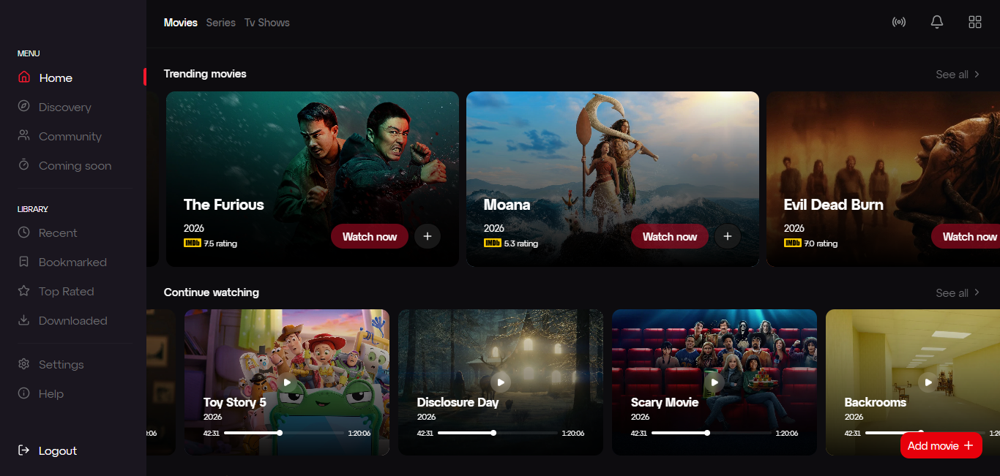

# 🎬 Trailer Park

> A modern movie streaming application built with React 19, TypeScript, and a feature-first architecture inspired by JAM-Forte Engineering Standards.

Unlike most movie apps built as UI showcases, Trailer Park focuses on maintainability, scalability, and clean frontend architecture—demonstrating how production React applications should be structured as they grow.



## 🏗 Architecture

Built around a feature-first architecture where every domain owns its components, hooks, and business logic.

- **Feature Isolation** — Prevents cross-feature coupling and improves scalability.
- **Server State** — Powered by TanStack Query for caching and API synchronization.
- **Client State** — Reserved for shared UI and session management.
- **Consistent Conventions** — Kebab-case files, PascalCase components, and predictable project structure.

## ⚡ Tech Stack

- React 19
- TypeScript
- Vite
- Tailwind CSS 4
- TanStack Query
- shadcn/ui

## 📂 Project Structure

```text
src/
├── components/
├── config/
├── contexts/
├── features/
├── services/
└── utils/
```

## 🚀 Getting Started

```bash
git clone https://github.com/Davemafy/trailer-park.git

npm install

npm run dev
```

## 🔒 Engineering Standards

- Feature-first architecture
- Clean separation of server and client state
- No hard-coded secrets
- Scalable folder organization
- Production-oriented conventions